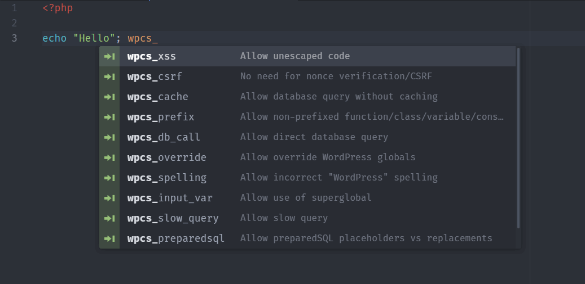

# Atom WPCS Whitelist Flags

Add all [WordPress Coding Standards whitelist flags](https://github.com/WordPress-Coding-Standards/WordPress-Coding-Standards/wiki/Whitelisting-code-which-flags-errors) as snippets to Atom.

Inspired by [WPCS Whitelist Flags For VSCode](https://github.com/claudiosanches/vscode-wpcs-whitelist-flags).

## License

[GPLv3](https://raw.githubusercontent.com/vijayhardaha/atom-wpcs-whitelist-flags/master/LICENSE)
